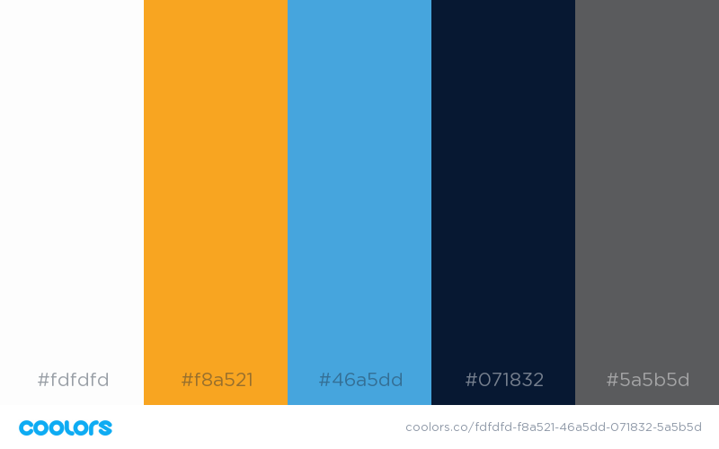

# tuxlab-assets
TuxLab is an open source platform for creating Interactive Linux Courses. This repository contains the assets for the Logo, Icons, Fonts and Design for TuxLab application.  If you are instead looking for the application source code itself, visit the [App Repository](https://github.com/learnlinux/tuxlab-app).

## Logo
The TuxLab logo is licensed under Creative Commons 3.0 with Attribution.

## Colors

## User Interface
The TuxLab interface is developed entirely using [Angular 2 Material](https://github.com/angular/material2).  You should follow [Google's Material Style guide](https://www.google.com/design/spec/material-design/introduction.html) whenever you are designing a component of the TuxLab project- be it an icon, UX item, or presentation.

## Icons
We use Google’s Material Icons exclusively (https://material.io/icons/).

## Fonts

* [Myriad Pro](https://typekit.com/fonts/myriad) – Copyright, Licensed under Adobe.
